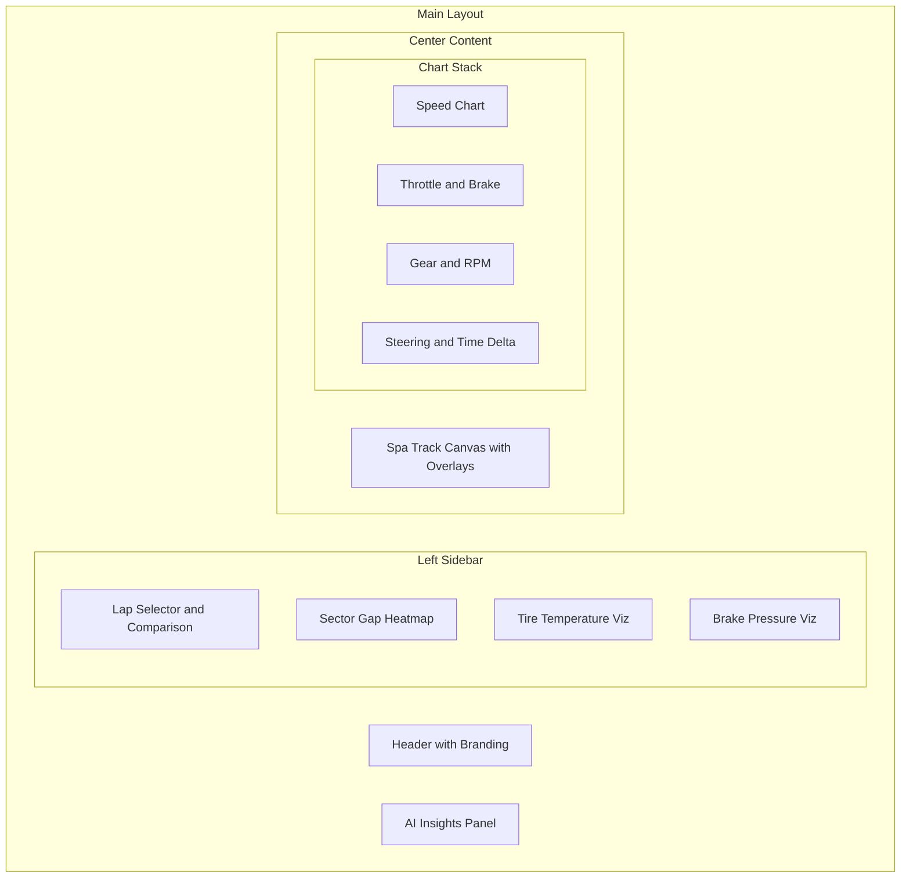

# Racing Telemetry Analysis Dashboard Redesign

## Current State Analysis

The existing [`LapAnalysis.tsx`](src/components/LapAnalysis.tsx) provides a functional but basic racing telemetry viewer with:

- 3 laps with color-coded lines (red, blue, purple)
- Basic synced charts for speed, throttle, brake, gear, RPM, steering
- A generic SVG track outline (not Spa)
- Sector gap heatmaps
- Synchronized cursor across charts

## Proposed Architecture




## Key Features to Implement

### 1. Track Map - Circuit de Spa-Francorchamps Canvas

- HTML5 Canvas with accurate Spa track outline (La Source, Eau Rouge, Raidillon, Les Combes, Stavelot, Bus Stop)
- Lap traces overlaid with each lap's assigned color
- Mouse hover shows position marker with synced telemetry values
- Sector boundaries visualized on track

### 2. Enhanced Lap Comparison System

- Color picker for each lap (persisted across all charts/visualizations)
- Add/remove laps from comparison dynamically
- "Compare with others" feature to load other users' laps
- Lap metadata display (driver, date, conditions)

### 3. Expanded Telemetry Charts using shadcn Chart

- Migrate from raw recharts to `@shadcn/chart` with `ChartContainer`, `ChartTooltip`, `ChartConfig`
- Charts: Speed, Throttle, Brake Pressure, Gear, RPM, Steering Angle, Time Delta, G-Forces (lateral/longitudinal)
- All charts synchronized with shared cursor state
- Resizable chart panels using `@shadcn/resizable`

### 4. Tire and Brake Visualizations

- 4-corner tire temperature heatmap (FL, FR, RL, RR) with inner/middle/outer zones
- Brake temperature/pressure gauges
- Visual wear indicators

### 5. AI Insights Panel

- Collapsible right-side panel or sheet
- AI-generated driving tips based on telemetry comparison
- "Areas to improve" suggestions (braking points, throttle application, racing line)
- Trend analysis across laps

### 6. UI Components to Install from shadcn

```javascript
chart tabs resizable scroll-area tooltip sheet dialog 
avatar switch slider collapsible popover accordion progress skeleton
```


## File Structure

```javascript
src/
  components/
    LapAnalysis.tsx         # Main redesigned component
    track/
      SpaCanvas.tsx         # Canvas-based Spa track with lap overlays
      TrackPositionMarker.tsx
    telemetry/
      TelemetryChart.tsx    # Unified chart component using shadcn chart
      SpeedChart.tsx
      ThrottleBrakeChart.tsx
      GearRPMChart.tsx
      SteeringChart.tsx
      TimeDeltaChart.tsx
    visualizations/
      TireHeatmap.tsx       # 4-corner tire temp visualization
      BrakePressureGauge.tsx
    ai/
      AIInsightsPanel.tsx   # AI recommendations panel
    comparison/
      LapSelector.tsx       # Lap selection with color management
      SectorGapTable.tsx    # Enhanced heatmap table
```


## Design Direction

- **Typography**: Use a technical/racing font like "JetBrains Mono" or "Orbitron" for data displays
- **Color Theme**: Dark theme with high-contrast racing colors, neon accents (cyan, magenta, lime) for lap lines
- **Animations**: Smooth transitions on hover, staggered reveals for panels
- **Background**: Subtle carbon fiber or circuit pattern texture

## Implementation Approach

1. Install required shadcn components
2. Create the Spa-Francorchamps canvas component with accurate track coordinates